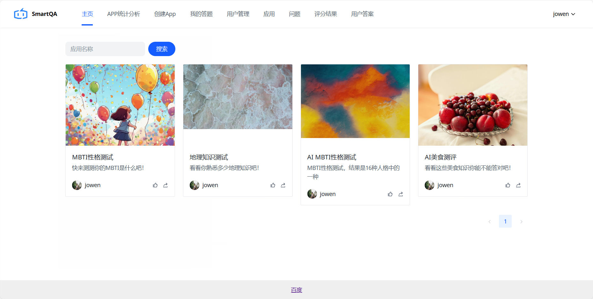

# SmartQA-AI智能问答平台

---

## 1. 项目介绍

SmartQA-AI智能问答平台是一个基于AI的智能问答平台。用户可以基于AI快速生成题目并制作应用，应用经过管理员审核通过后，可以开放答题并基于AI生成评测结果。管理员还可以集中管理应用，问题，用户等内容，并进行统计分析。

## 2. 项目技术栈
1. 前端：Vue3 + Vue-Router + Vuex + Axios + Arco Design + Vue-ECharts + UmiJS/OpenAPI
2. 后端：SpringBoot + SpringAI + MyBatis-Plus + MySQL + Caffeine + Redis + ShardingSphere + MinIO + Spring Validation
3. 部署：Docker + Nginx

## 3. 体验地址
https://smartqa.fun

